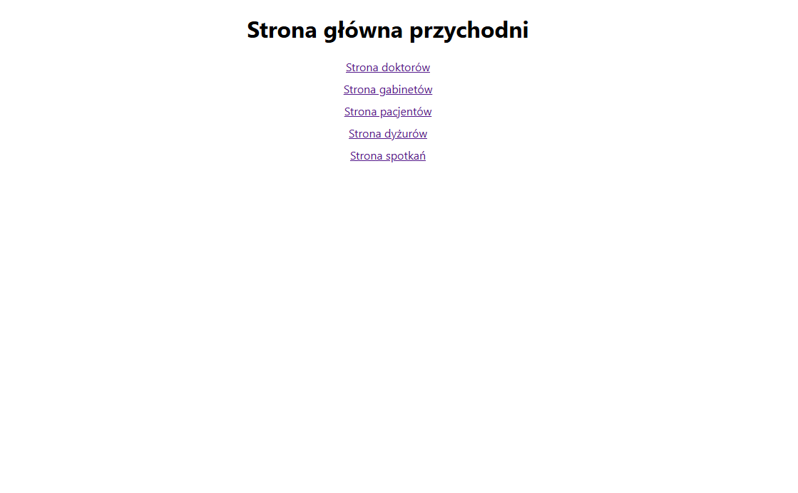
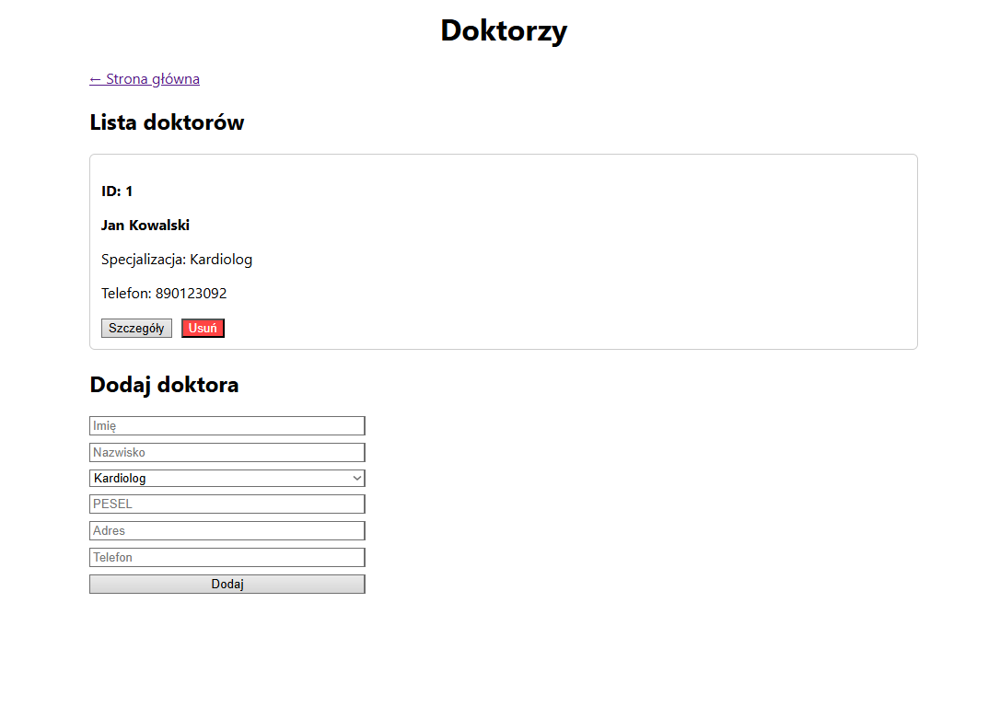
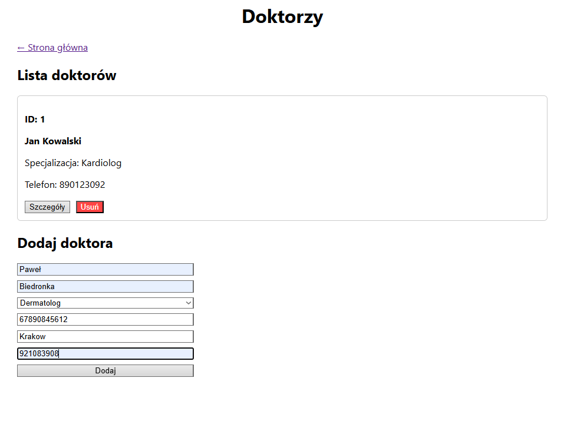
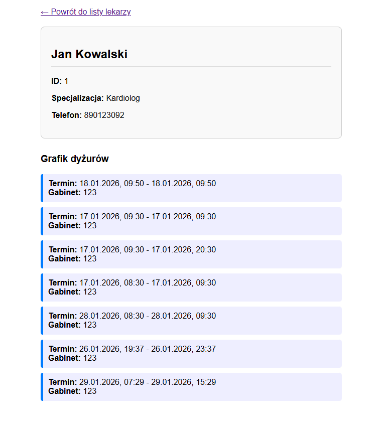
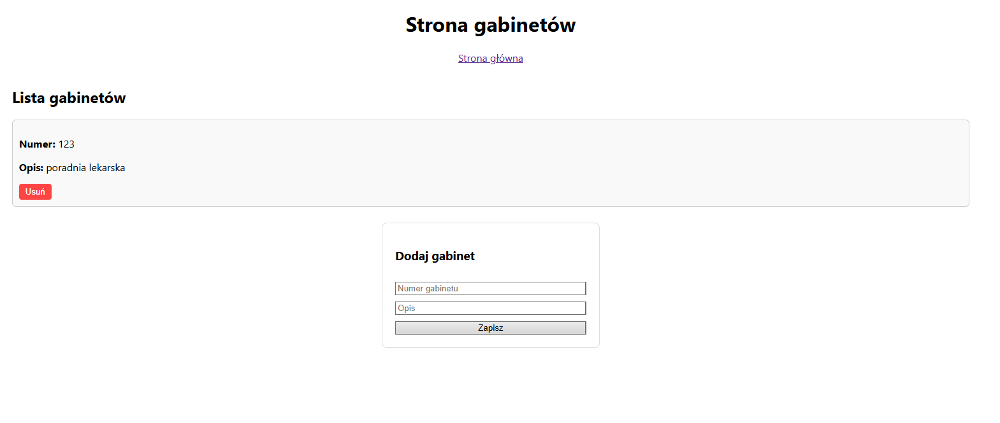
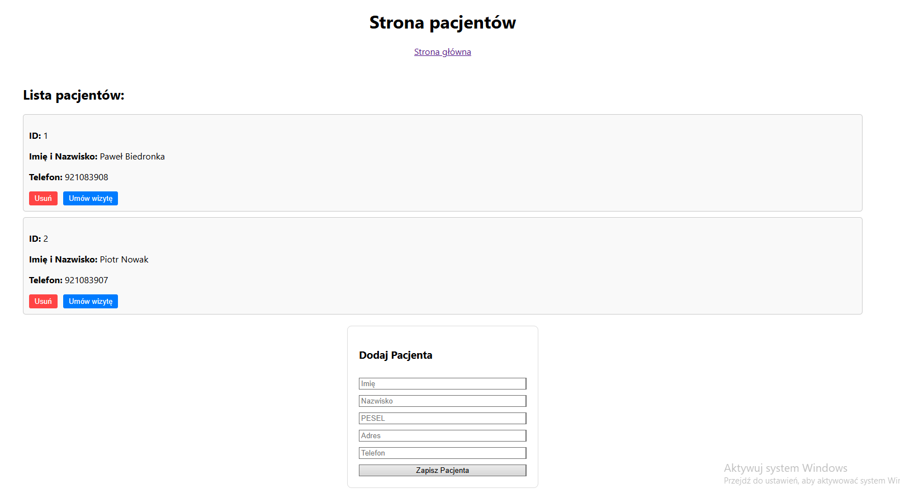
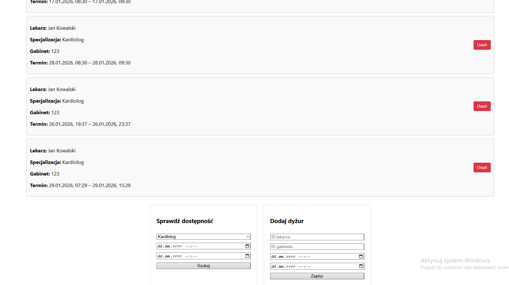
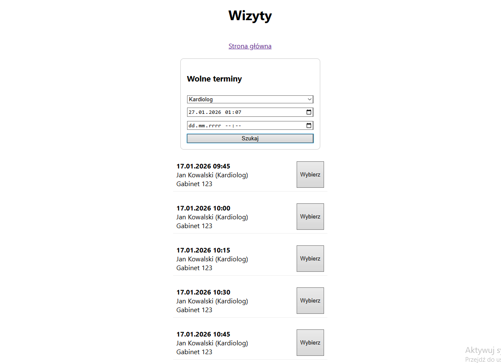
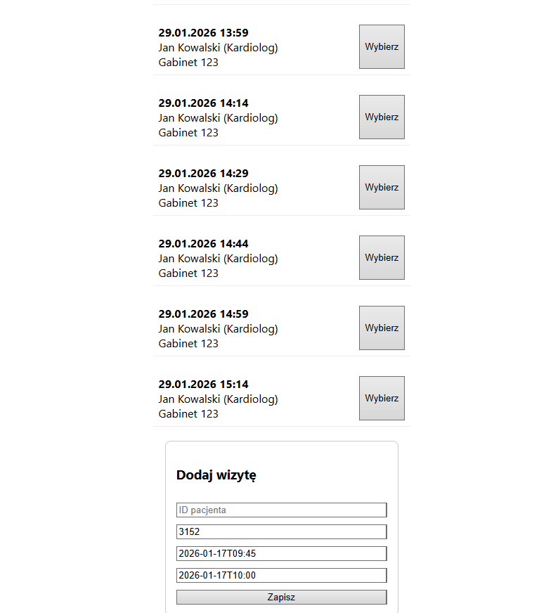

# DK_wt_0800_Orzechowcy
Projekt zaliczeniowy na Technologie Obiektowe 2025/2026

---

## Uruchomienie Aplikacji
1. Uruchamiamy backend
   1. Z folderu projektu wchodzimy do : `przychodnia/src/main/java/pl/edu/agh/to/przychodnia` 
   2. Odpalamy PrzychodniaApplication.java. API pojawi się pod adresem `localhost:8080`
2. Uruchamiamy GUI
   1. Otworzyć terminal w katalogu projektu
   2. Przejść do katalogu ui: ```cd ui```
   3. Zainstalować zależności: ```npm install```
   4. Uruchomić UI: ```npm start```. Strona pojawi się pod adresem ```localhost:3000```

## Schematy Aplikacji

### Schemat klasowy z relacjami:

Diagramy klas UML znajdują się w plikach:
```DiagramKlasBezRelacji.drawio```, ```DiagramKlas.drawio``` oraz ```UproszczonyDiagramKlas.drawio```.

Można je łatwo otworzyć na stronie internetowej:
https://app.diagrams.net/

W przypadku diagramu uproszczonego, można też skorzystać z wersji do otwarcia w przeglądarce: ```UproszczonyDiagramKlas.drawio.html```.


## JavaDoc 

Znajduję się w [Javadoc](javadoc/index.html)

## Widok Aplikacji

(Po uruchomieniu znajduje się na [localhost](http://localhost:3000))

### Strona główna

To z niej dostajemy się do poszczególnych stron



### Strona doktorów

Na górze wyświetla się lista w formie list kart w których mamy id doktora, pełne imie, specjalizację i telefon oraz dwa przyciski jeden do przejścia na strone z szczegółami doktora drugi do kasowania.

Poniżej listy mamy formsa do dodawania doktora





### Podstrona z szczegółami doktora

Mamy informację doktora wraz z jego grafikiem dyżurów



### Strona Gabinetów

Strona gabinetów zawiera listę gabinętów wraz z formsem do dodania gabinetu.



### Strona Pacjentów

Strona posiada listę pacjentów oraz formsa do dodawania pacjentów. Z listy pacjentów pojedyńczego pacjenta można usunąć lub zarezerwować dla niego wizyte. (Jak przez tą strone wejdziemy na strona wizyt to w formsie mamy odrazu zaznaczony id pacjenta w dodaniu wizyty)




### Strona Dyżurów

Lista dyżurów doktorów z możliwością kasowania oraz forms z sprawdzaniem dostępnych lekarzy do dodania dyżuru.

!

### Strona Wizyt

Strona do umawiania wizyt. Najpierw wpisujemy wolne terminy a później z dostępnych (max 7 dni od wybranego terminu) wybieramy przez przycisk `Wybierz` który wypełnia nam pola w formsie dla dodawania wizyty.


